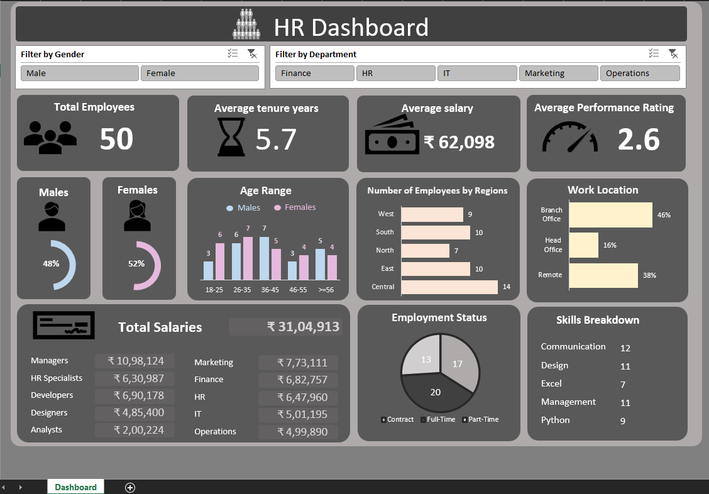

# HR Analytics Excel Dashboard

An interactive HR analytics dashboard built in Microsoft Excel to analyze workforce demographics, employee performance, attrition, and other key HR metrics.

## Dashboard Preview

## Project Overview

This project demonstrates the use of Excel for HR data analysis and dashboard reporting. The dashboard transforms employee data into an interactive visual report that allows users to explore important workforce metrics and identify patterns across different employee groups.

## Key Features

- Interactive filters by gender and department
- Total employee headcount
- Average employee tenure
- Average salary analysis
- Average performance rating
- Gender distribution
- Employee age distribution
- Regional workforce distribution
- Work location analysis
- Employment status analysis
- Employee skills breakdown
- Total salary overview

## Tools & Skills

- Microsoft Excel
- Pivot Tables
- Pivot Charts
- Slicers
- Data Cleaning
- Data Analysis
- Dashboard Design
- Data Visualization

## Dashboard File

The complete interactive Excel dashboard is available in this repository:

**[Download HR Dashboard.xlsx](HR%20Dashboard.xlsx)**

> Download and open the workbook in Microsoft Excel to use the interactive dashboard and filters.

## Author

**Nikhil Ullal**

Data Analyst | Market Research & Data Processing Professional
